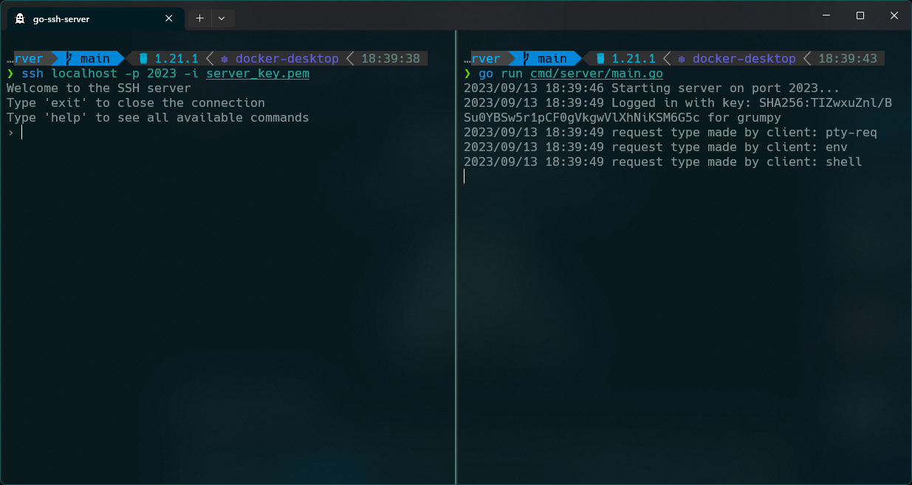

<div align="center">
    <h1><code>🐰</code> SSH Server</h1>
    <strong>SSH Server</strong> is a simple SSH server written in Go.
    <div>
        
    </div>
</div>

## `📸` Screenshots



## `📝` About

This project is a simple SSH server written in Go. It is intended to be used as a library for other projects, but it can also be used as a standalone SSH server.

## `🚀` Usage

### `🔐` Key Generation

```bash
go run cmd/keygen/main.go
```

### `🏭` Server

**[Server](cmd/server/main.go)**

```bash
go run cmd/server/main.go
```

### `📦` Client

- **[Client](cmd/client/main.go)** Execute a command

```bash
go run cmd/client/main.go
```

```bash
ssh localhost -p 2022 -i server_key.pem "whoami"
```

- Interactive shell

```bash
ssh localhost -p 2023 -i server_key.pem
```

## `📚` References

- [gliderlabs/ssh](https://pkg.go.dev/github.com/gliderlabs/ssh?utm_source=godoc)
- [golang/crypto](https://pkg.go.dev/golang.org/x/crypto?utm_source=godoc)
- [golang/term](https://pkg.go.dev/golang.org/x/term?utm_source=godoc)
- [golang/net](https://pkg.go.dev/golang.org/x/net?utm_source=godoc)
- [golang/sys](https://pkg.go.dev/golang.org/x/sys?utm_source=godoc)

## `⚖️` License

This project is licensed under the MIT License - see the [LICENSE](LICENSE) file for details.
